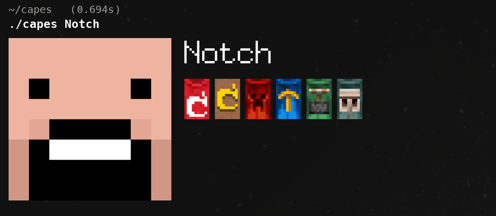

# capes



---

a tiny cli tool to view minecraft player heads and capes directly in your terminal.  
it fetches data from [capes.me](https://capes.me) and renders images inline using [kitty icat](https://sw.kovidgoyal.net/kitty/kittens/icat/).

---

## features

- show a player's minecraft head and equipped capes
- fetches cape metadata and textures from capes.me
- caching system to avoid unnecessary api calls
- lightweight image layout with head, username, and capes
- renders inline in kitty terminal (via `kitty +kitten icat`)
- fully configurable display and layout options

---

## install

clone the repo and build with go:

```sh
git clone https://github.com/dorocha/capes
cd capes
go build -o capes
```
---

### add to path

move the binary into a folder already in your path, for example:

```sh
sudo mv capes /usr/local/bin/
```

or add the project folder to your path (e.g. in `~/.bashrc` or `~/.zshrc`):

```sh
export PATH=$PATH:$(pwd)
```

reload your shell:

```sh
source ~/.bashrc   # or ~/.zshrc
```

now you can run:

```sh
capes notch
```

---

## usage

```sh
capes notch
```

outputs the player head, username, and any visible capes in your terminal.

### default username

if you set a `default_username` in the config file, you can run the command without arguments:

```sh
capes
```

---

## configuration

on first run, capes automatically creates a configuration file at `~/.config/capes/config.json` (or `$XDG_CONFIG_HOME/capes/config.json`). you can edit this file to customize the appearance and behavior.

### configuration options

#### default user
```json
{
  "default_username": "notch"
}
```
- **default_username**: username to use when no argument is provided

#### display settings
```json
{
  "display": {
    "head_size": 8,
    "layout_height": 48,
    "upscale_factor": 4,
    "show_head_only": true
  }
}
```
- **head_size**: size in terminal cells when displaying head-only (default: 8)
- **layout_height**: size in terminal cells for full layout with capes (default: 48)
- **upscale_factor**: image upscaling multiplier for better quality (default: 4)
- **show_head_only**: whether to show head when no capes are found (default: true)

#### layout settings
```json
{
  "layout": {
    "spacing": 5,
    "cape_spacing": 2,
    "capes_per_row": 0,
    "username_row_height": 14,
    "cape_start_offset": 2,
    "available_cape_width": 200
  }
}
```
- **spacing**: pixels between major elements (head, username area, cape area) (default: 5)
- **cape_spacing**: pixels between individual capes (default: 2)
- **capes_per_row**: maximum capes per row, 0 for auto-calculation (default: 0)
- **username_row_height**: vertical space allocated for username text (default: 14)
- **cape_start_offset**: additional vertical offset for cape positioning (default: 2)
- **available_cape_width**: available width for cape area when auto-calculating capes per row (default: 200)

#### cache settings
```json
{
  "cache": {
    "cache_ttl_hours": 24,
    "cache_dir": "cache"
  }
}
```
- **cache_ttl_hours**: how long to cache downloaded images in hours (default: 24)
- **cache_dir**: directory for cached files relative to current directory (default: "cache")

#### network settings
```json
{
  "network": {
    "timeout_seconds": 15,
    "user_agent": "Mozilla/5.0 (capes-cli)"
  }
}
```
- **timeout_seconds**: http request timeout in seconds (default: 15)
- **user_agent**: user agent string for http requests (default: "Mozilla/5.0 (capes-cli)")

### example configuration

here's a sample configuration for a more compact layout:

```json
{
  "default_username": "notch",
  "display": {
    "head_size": 6,
    "layout_height": 32,
    "upscale_factor": 3,
    "show_head_only": true
  },
  "layout": {
    "spacing": 3,
    "cape_spacing": 1,
    "capes_per_row": 3,
    "username_row_height": 12,
    "cape_start_offset": 1,
    "available_cape_width": 150
  },
  "cache": {
    "cache_ttl_hours": 48,
    "cache_dir": "cache"
  },
  "network": {
    "timeout_seconds": 10,
    "user_agent": "Mozilla/5.0 (capes-cli)"
  }
}
```

### configuration location

the config file is created following the xdg base directory specification:
- **linux/macos**: `~/.config/capes/config.json`
- **with xdg_config_home**: `$XDG_CONFIG_HOME/capes/config.json`

---

## requirements

* [go](https://golang.org/dl/) (for building)
* [kitty terminal](https://sw.kovidgoyal.net/kitty/)
* [imagemagick](https://imagemagick.org/) (used to upscale images before rendering)

---

## notes

* works best in kitty with image rendering enabled
* caches heads and capes in configurable directory for configurable time
* usernames or uuids supported
* hidden or removed capes are ignored
* configuration is automatically created on first run

---

## license

mit