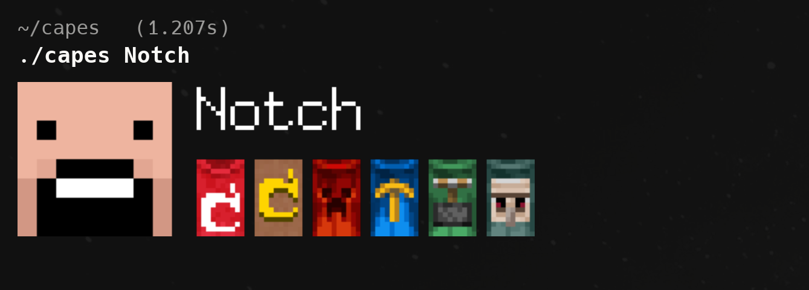

# capes



---

a tiny cli tool to view minecraft player heads and capes directly in your terminal.  
it fetches data from [capes.me](https://capes.me) and renders images inline using [kitty icat](https://sw.kovidgoyal.net/kitty/kittens/icat/).

---

## features

- show a player's minecraft head and equipped capes
- fetches cape metadata and textures from capes.me
- caching system to avoid unnecessary api calls
- lightweight image layout with head, username, and capes
- renders inline in kitty terminal (via `kitty +kitten icat`)

---

## install

clone the repo and build with go:

```sh
git clone https://github.com/dorocha/capes
cd capes
go build -o capes
```
---

### add to path

move the binary into a folder already in your path, for example:

```sh
sudo mv capes /usr/local/bin/
```

or add the project folder to your path (e.g. in `~/.bashrc` or `~/.zshrc`):

```sh
export PATH=$PATH:$(pwd)
```

reload your shell:

```sh
source ~/.bashrc   # or ~/.zshrc
```

now you can run:

```sh
capes notch
```

---

## usage

```sh
capes notch
```

outputs the player head, username, and any visible capes in your terminal.

---

## requirements

* [go](https://golang.org/dl/) (for building)
* [kitty terminal](https://sw.kovidgoyal.net/kitty/)
* [imagemagick](https://imagemagick.org/) (used to upscale images before rendering)

---

## notes

* works best in kitty with image rendering enabled
* caches heads and capes in `cache/` folder for 24h
* usernames or uuids supported
* hidden or removed capes are ignored

---

## license

mit
